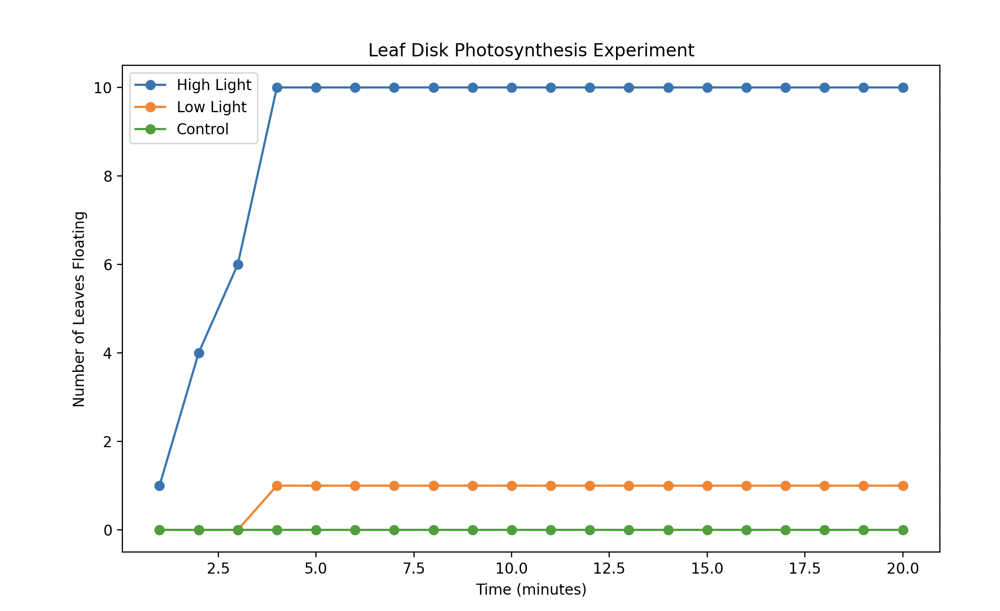

# Leaf Disk Photosynthesis Graph

## Overview

This repository contains a Python script for generating a line graph of the Leaf Disk Photosynthesis Experiment. The script visualizes the number of leaves floating under high light, low light, and control conditions over a 1-20 minute time range.



# About the Leaf Disk Photosynthesis Experiment

## Experiment Overview

The Leaf Disk Photosynthesis Experiment is a classic biology experiment used to study the process of photosynthesis in plants. Photosynthesis is the fundamental process by which green plants and other autotrophic organisms convert light energy, typically from the sun, into chemical energy in the form of glucose and other carbohydrates.

In this experiment, we investigate the rate of photosynthesis by measuring the number of leaf disks that rise to the surface of a solution over time. Leaf disks, typically cut from leaves of aquatic plants, will sink in a solution due to their high oxygen content. As photosynthesis occurs and oxygen is produced in the presence of light, the leaf disks will start to float as gas bubbles form inside them.

## Purpose

The Leaf Disk Photosynthesis Experiment serves several educational purposes:

- Demonstrating the role of light in photosynthesis.
- Observing the factors affecting the rate of photosynthesis, such as light intensity.
- Providing hands-on experience in designing and conducting experiments.
- Understanding the scientific method and data analysis.

## How the Script Helps

The Python script provided in this repository automates the process of creating a line graph to visualize the results of the Leaf Disk Photosynthesis Experiment. It allows for easy visualization of the number of leaves floating under different conditions (e.g., high light, low light, and control) as a function of time.

By using this script, you can efficiently analyze your experimental data and visualize the photosynthesis rate over time. The script is customizable, making it suitable for various experimental setups and conditions.

We hope that this script simplifies the analysis of your experiments and encourages further exploration of photosynthesis and plant biology.

## Usage

1. Make sure you have Python and Matplotlib installed on your system.
2. Clone this repository to your local machine:

   ```shell
   git clone https://github.com/your-username/Leaf-Disk-Photosynthesis-Graph.git
   ```
3. Navigate to the repository directory:

```shell
cd Leaf-Disk-Photosynthesis-Graph
```

4. Open the Python script (`leaf_disk_experiment_graph.py`) in your preferred code editor.
5. Customize the script with your own data or modify graph settings as needed.
6. Run the script to generate the line graph:

```shell
python leaf_disk_experiment_graph.py
```

4. The graph will be displayed and saved as a PNG file named `leaf_disk_experiment_graph.png` in the same directory.

## Script Details

* `leaf_disk_experiment_graph.py`: Python script for generating the line graph of the Leaf Disk Photosynthesis Experiment.
* `leaf_disk_experiment_graph.png`: Sample output graph.

## License

This script is provided under the MIT License. Feel free to use and modify it for your own experiments and projects.

## Author

Abel Mendoza

## Contact

If you have any questions or suggestions, feel free to contact me at [abelxmendoza@gmail.com.com](abelxmendoza@gmail.com.com).

Happy experimenting!
